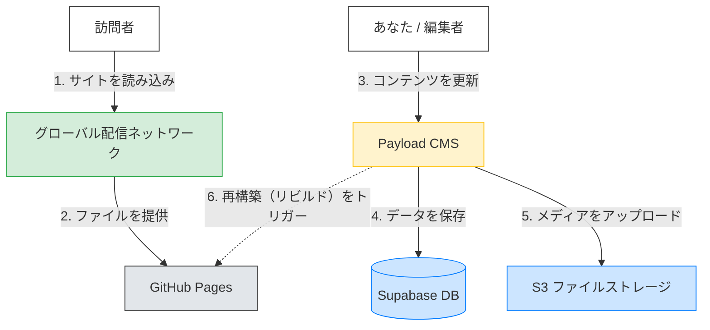
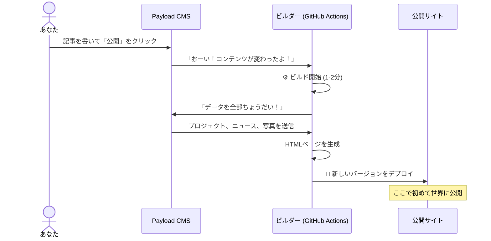

# アーキテクチャガイド: MA3の仕組み
*ロボットではなく、人間のための解説*

## 30秒でわかる概要

（WordPressのような）ほとんどのウェブサイトは、誰かが訪れるたびに**その都度**ページを作成します。これは、注文が入ってから料理を一から作るレストランのようなもので、柔軟ですが時間はかかります。

**MA3は「静的サイト（Static Site）」です。** 私たちはすべての食事を事前（「ビルド」中）に調理し、お弁当箱に詰め、世界中に出荷しておきます。訪問者が来たときには、食事はすでに用意されています。これにより、**瞬時の表示**と**壊れにくさ**が実現します。

---

## 1. 全体像

あなたのウェブサイトは、専門化されたサービスが連携するチームです。

### 主要プレイヤー
1.  **Astro & GitHub Pages (店舗):** ユーザーが見る部分です。シンプルなHTMLファイルだけで構成されています。訪問時にサーバー側で複雑な処理を行わないため、クラッシュすることがありません。
2.  **Payload CMS (指令室):** 文章の編集や写真のアップロードを行うための管理画面です。あなたのプライベートサーバー上にあります。
3.  **Supabase (金庫):** 実際にテキストやファイルを保管する安全なデータベースです。Payload CMSはここにデータを保存します。
4.  **BunnyCDN (配送トラック):** 東京にいてもニューヨークにいても写真がすぐに表示されるように、世界中のサーバーにコピーを保管するネットワークです。

---

## 2. 「静的」の魔法（更新の仕組み）

これが最も重要なコンセプトです。サイトは事前に構築されるため、**変更は「その瞬間」には反映されません**。「ビルド（構築）」に約1〜2分かかります。

### 「ビルド」のライフサイクル

1.  **編集:** CMSでタイトルを変更します。
2.  **待機:** システムが自動的に目覚め、新しいコンテンツをすべて取得し、ウェブサイト全体を「再印刷」します。
3.  **公開:** 古いバージョンが新しいバージョンに一瞬で切り替わります。

---

## 3. なぜWordPressではなくこれなのか？（トレードオフ）

私たちは特定の理由があってこのアーキテクチャを選びました。すべてにおいて「優れている」わけではありませんが、**このプロジェクトにとっては**最適です。

| 機能 | WordPress (従来型) | MA3 (静的アーキテクチャ) |
| :--- | :--- | :--- |
| **速度** | 🐢 **遅い。** サーバーは訪問者ごとに「考える」必要がある。 | ⚡ **瞬時。** 事前に構築されたHTMLを表示するだけ。 |
| **セキュリティ** | 🛡️ **リスクあり。** ハッカーの標的（プラグイン、ログイン画面）が公開されている。 | 🔒 **鉄壁。** 公開サイトにはハッキングできるデータベースもログイン画面もない。 |
| **コスト** | 💸 **高い。** トラフィックを処理するための強力なサーバーにお金がかかる。 | 🆓 **無料/安い。** フロントエンドのホスティングはGitHubが無料提供。 |
| **アクセス集中** | 📉 **ダウンする。** リンクがバズるとサーバーがクラッシュすることがある。 | 📈 **無敵。** 1人でも100万人でも同じように処理できる。 |
| **更新** | ✅ **瞬時。** 保存すれば1秒後には反映される。 | ⚠️ **タイムラグあり。** 保存してからビルド完了まで約2分待つ必要がある。 |
| **柔軟性** | ✅ **プラグイン。** 「カレンダー」などを自分でインストールして追加できる。 | ⚠️ **開発者が必要。** 新しい「機能」（コンテンツではなく）を追加するにはプログラマーが必要。 |

### トレードオフのまとめ
**「瞬時の更新」**と**「DIYでのプラグイン追加」**を手放す代わりに、**「圧倒的な速度」**、**「セキュリティ」**、**「信頼性」**を手に入れました。

---

## 4. 詳細: インフラの裏側

技術的に興味がある方のために、アセット（素材）がどう扱われるか説明します。

### Supabase (データベース & ストレージ)
ファイルをCMSサーバーにただ保存するだけではありません（サーバーが壊れたら大変です）。私たちは **Supabase** を使用しています。
- **Postgres DB:** テキストコンテンツを保存します。業務グレードの信頼性があります。
- **S3 Storage:** アップロードされた元の画像や動画を保存します。

### BunnyCDN (コンテンツ配信ネットワーク)
巨大な10MBの画像をアップロードした場合:
1.  **Payload** がそれを **Supabase** にアップロードします。
2.  **BunnyCDN** がそれを検知し、最適化されたコピー（小さく、ウェブに適した形式）を作成します。
3.  ロンドンのユーザーがアクセスすると、BunnyCDNはメインサーバーではなく、ロンドンのサーバーから画像を提供します。

これにより、どこにいても、4Gモバイル回線でさえ、ポートフォリオが鮮明かつ高速に表示されます。
