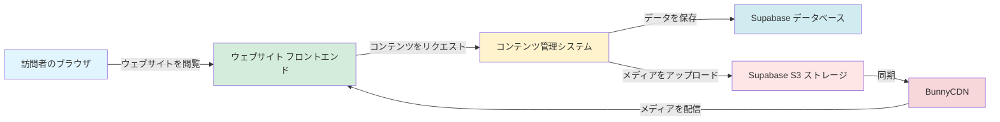
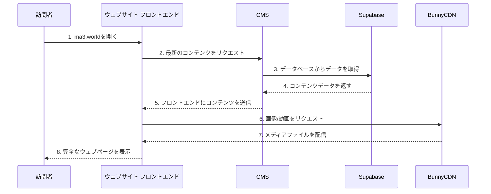
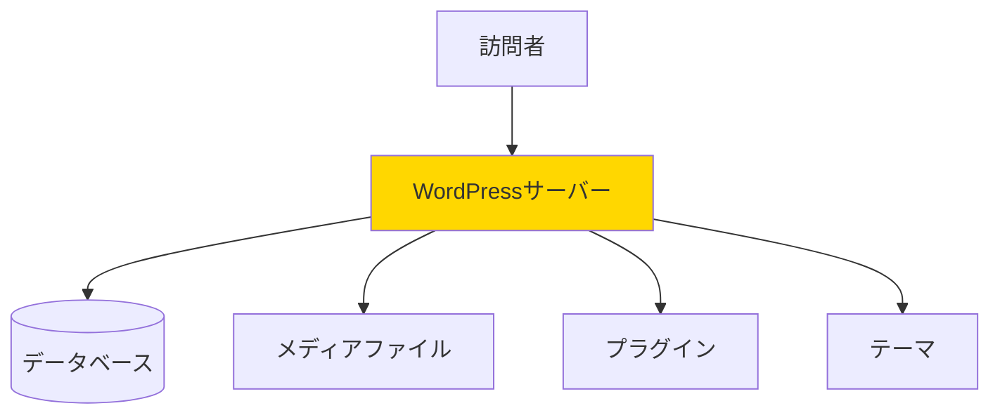
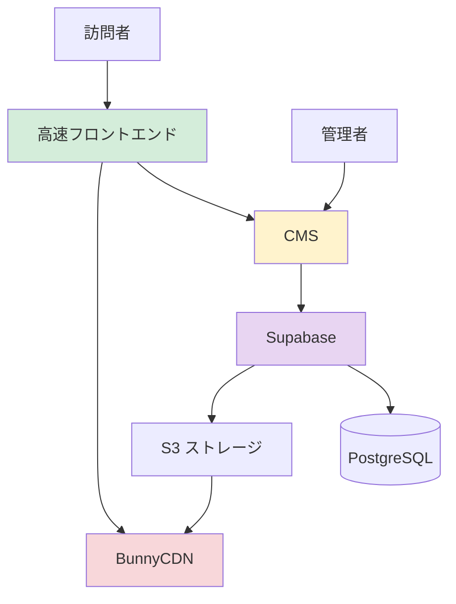
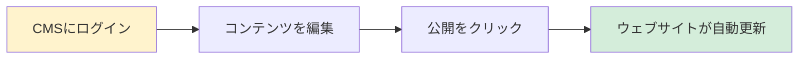

# MA3ウェブサイト アーキテクチャガイド
*非技術者向けのシンプルな説明*

## このウェブサイトとは？

MA3ウェブサイトは、最高速度、柔軟性、コントロールを実現するために設計された、モダンで高性能なウェブサイトです。カスタムメイドのスポーツカーのようなものと考えてください。一方、WordPressは標準的なファミリーカーのようなものです。どちらも目的地に到達できますが、内部の仕組みは大きく異なります。

---

## 3つの主要パーツ

ウェブサイトは、3つの独立したパーツで構成されていますが、それぞれが連携して動作します。よく組織されたチームのようなもので、各メンバーが特定の役割を持っています。



### 1. **ウェブサイト フロントエンド**（訪問者が見るもの）
- **技術:** Astro と React
- **ホスティング:** GitHub Pages（無料で世界中に高速配信）
- **役割:** 訪問者がブラウザで見る実際のウェブサイトです。プロジェクト、ニュース、お問い合わせ情報など、すべてのビジュアル要素を表示します。
- **例え:** お店の店頭 — 美しく、速く、あなたが望む通りに設計されています。

### 2. **コンテンツ管理システム**（コントロールパネル）
- **技術:** Payload CMS
- **ホスティング:** あなた自身のサーバー
- **役割:** これはあなた専用の管理パネルで、新しいプロジェクトの追加、ニュースの更新、画像のアップロード、すべてのウェブサイトコンテンツの管理ができます。あなた（またはアクセス権を与えた人）だけがログインできます。
- **例え:** お店のバックオフィス — 在庫を管理し、更新を準備する場所。

### 3. **データベース & ストレージ**（データ管理）
- **技術:** Supabase（PostgreSQL + S3 ストレージ）
- **役割:** すべてのコンテンツデータ（テキスト、設定、関連性）と元のメディアファイルを、安全で管理されたデータベースおよびストレージシステムに保存します。
- **例え:** データ用の整理されたファイルキャビネットとファイル用の保管室を備えた、高度に安全な金庫。

### 4. **メディア配信**（世界中への高速アクセス）
- **技術:** BunnyCDN
- **役割:** 訪問者の近くにあるサーバーにキャッシュすることで、画像や動画を世界中の訪問者に素早く配信します。
- **例え:** 即座にアクセスできるように、世界中の倉庫にファイルのコピーを保管する宅配便ネットワーク。

---

## パーツがどのように連携するか

誰かがあなたのウェブサイトを訪れたときの流れは次のとおりです。



1. **訪問者がウェブサイトのアドレスを入力**（ma3.world）
2. **ウェブサイトのフロントエンドが読み込まれる**（GitHub Pagesから、非常に速い！）
3. **フロントエンドがCMSに質問**「どのプロジェクトを表示すべき？最新のニュースは？」
4. **CMSがすべてのコンテンツデータで応答**
5. **フロントエンドがBunnyCDNに画像をリクエスト**
6. **BunnyCDNが画像を非常に速く配信**
7. **訪問者がすべてのコンテンツと画像を含む完全なウェブサイトを見る**

---

## 詳細なアーキテクチャ

### レイヤー1: プレゼンテーション層（フロントエンド）

**訪問者が操作するもの:**
- 美しいアニメーション付きウェブページ
- インタラクティブな3D地球儀
- プロジェクトギャラリー
- ニュース記事
- お問い合わせフォーム

**主な機能:**
- **超高速** — ほぼ瞬時に読み込まれる
- **英語と日本語で動作** — 自動言語切り替え
- **レスポンシブデザイン** — スマートフォン、タブレット、コンピューターで完璧に表示
- **SEO最適化** — Googleが簡単に見つけてランク付けできる

### レイヤー2: コンテンツ層（CMS）

**コンテンツ管理に使用するもの:**
- 使いやすい管理ダッシュボード
- 記事用のリッチテキストエディタ
- 画像のアップロードと管理
- 下書き/公開ワークフロー
- メール通知

**主な機能:**
- **セキュア** — ログイン認証情報でのみアクセス可能
- **柔軟性** — 新しいタイプのコンテンツを簡単に追加できる
- **リアルタイム** — 変更がすぐにウェブサイトに反映される
- **多言語対応** — 英語と日本語のコンテンツを管理

### レイヤー3: データ & ストレージ層

**データベース（Supabase PostgreSQL）:**
- すべてのコンテンツテキスト、プロジェクト、ニュース、設定を保存
- コンテンツ間の関係性を追跡
- リアルタイム更新と強力なクエリを提供
- 完全に管理されている — サーバーメンテナンス不要

**ファイルストレージ（Supabase S3）:**
- 元の画像、動画、ドキュメントを保存
- 安全でスケーラブルなストレージを提供
- 統合された認証とアクセス制御

**メディア配信（BunnyCDN）:**
- 世界中のサーバーからメディアをキャッシュして配信
- より速い読み込みのために画像を自動的に最適化
- エッジキャッシングでストレージの負荷を軽減

---

## WordPressとの違い

ほとんどの人はWordPressに精通しているので、比較してみましょう。

### WordPressのアプローチ（オールインワン）



WordPressでは、**すべてが1つのサーバーで起こります:**
- ウェブサイトのフロントエンド
- 管理パネル
- データベース
- ファイルストレージ
- すべてのプラグインとテーマ

**例え:** ダイニングエリア、キッチン、ストレージ、オフィスがすべて1つの小さな部屋にあるレストランのようなものです。

### あなたのアプローチ（分離 & 専門化）



あなたの設定では、**各パーツが専門化され、分離されています:**
- ウェブサイトのフロントエンドは速度のために最適化
- CMSはコンテンツ管理に焦点
- メディアはグローバルネットワークによって配信
- 各パーツを独立してアップグレード可能

**例え:** ダイニングルームが美しく広々としていて、キッチンがプロ仕様で、供給品が専門ベンダーから来る現代的なレストランのようなものです。

---

## WordPressに対する利点

### 🚀 **速度**
- **WordPress:** ページをオンデマンドで生成（遅い、注文ごとに料理を作るようなもの）
- **あなたのサイト:** 事前に構築されたページが瞬時に提供される（準備万端のビュッフェのようなもの）
- **結果:** あなたのサイトはミリ秒で読み込まれる。WordPressは数秒かかることもある

### 🔒 **セキュリティ**
- **WordPress:** 管理パネルとウェブサイトが同じサーバー上（ハッカーにとって1つのターゲット）
- **あなたのサイト:** CMSは分離されて隠されている。公開サイトには管理者アクセスがない
- **結果:** ハッキングがはるかに困難。ウェブサイトが攻撃されてもCMSは安全

### 💰 **コスト**
- **WordPress:** ウェブホスティング料金、通常月額$5-50
- **あなたのサイト:** 
  - フロントエンドホスティング: 無料（GitHub Pages）
  - データベース & ストレージ: Supabase（無料枠または従量課金）
  - CMS: あなた自身のサーバー（コストを管理できる）
  - CDN: BunnyCDN（使用した帯域幅のみ支払い）
- **結果:** 特にトラフィックが増えるにつれて、はるかに安価になる可能性

### 🎨 **柔軟性**
- **WordPress:** テーマとプラグインによって制限される。カスタマイズすると壊れることがある
- **あなたのサイト:** 完全なコントロール。あなたの仕様通りに正確に構築
- **結果:** ユニークなデザイン、妥協なし、余分なものなし

### 📊 **スケール時のパフォーマンス**
- **WordPress:** トラフィックが増えると遅くなる。高価なキャッシングプラグインが必要
- **あなたのサイト:** 大量のトラフィックを簡単に処理。すでに最適化されキャッシュされている
- **結果:** 成長してもパフォーマンスの低下なし

### 🔧 **メンテナンス**
- **WordPress:** プラグイン/テーマの絶え間ない更新。破損のリスクが高い
- **あなたのサイト:** 最小限のメンテナンス。更新は管理されテストされる
- **結果:** 修正に費やす時間が少なく、コンテンツ作成に多くの時間を費やせる

### 🌍 **グローバル配信**
- **WordPress:** 1つの場所から提供される（遠くの訪問者にとっては遅い）
- **あなたのサイト:** グローバルに分散（どこでも全員に高速）
- **結果:** 日本とアメリカの訪問者が同じ高速体験を得る

---

## 技術スタック（簡単な説明）

### フロントエンド技術

**Astro**
- モダンなウェブサイトフレームワーク
- 高速で最適化されたページを生成
- 例え: ウェブページを構築するための設計図システム

**React**
- インタラクティブなコンポーネントを作成（3D地球儀など）
- 例え: アニメーションとインタラクションの専門家

**TailwindCSS**
- 美しいデザインのためのスタイリングシステム
- 例え: インテリアデザイナー

### バックエンド技術

**Payload CMS**
- モダンなコンテンツ管理システム
- カスタマイズと拡張が簡単
- 例え: 優れたインターフェースを備えたスマートファイリングキャビネット

**PostgreSQL**
- 強力で信頼性の高いデータベース
- 例え: 高度に組織化されたデジタルライブラリ

**Next.js**
- CMSを実行するフレームワーク
- 例え: 管理パネルを動かすエンジン

### サポートサービス

**Supabase**
- オールインワンバックエンドプラットフォーム
- PostgreSQLデータベースとS3互換ストレージを提供
- 例え: すべてのバックエンドニーズを処理する管理データセンター

**BunnyCDN**
- グローバルコンテンツ配信ネットワーク
- 例え: メディア用の世界的な配送サービス

**GitHub Pages**
- 無料の静的サイトホスティング
- 例え: 課金しない信頼性の高い高速ウェブサーバー

---

## モノレポ構造

あなたのプロジェクトは「モノレポ」を使用しています — すべてのコードが1つの整理された場所にあります。

```
MA3 プロジェクト
├── apps/
│   ├── web/          → ウェブサイトのフロントエンド（Astro）
│   └── cms/          → 管理パネル（Payload CMS）
├── packages/         → 共有コードとユーティリティ
└── scripts/          → ビルドとデプロイメントツール
```

**なぜこれが重要か:**
- **整理:** MA3に関連するすべてが1つの場所にある
- **効率性:** 共有コードを複製する必要がない
- **シンプルさ:** 1つのコマンドでフロントエンドとCMSの両方をローカルで実行
- **バージョン管理:** すべての変更が一緒に追跡される

同じビジネスパーク内の別々の建物にあるが独立して運営されている、お店と倉庫を持っているようなものと考えてください。

---

## 開発ワークフロー

変更を加えたい場合の流れは次のとおりです。

### コンテンツ更新



1. **CMSにログイン**（管理パネル）
2. **コンテンツを追加または編集**（プロジェクト、ニュース、画像）
3. **公開をクリック**
4. **ウェブサイトが自動的に更新される**（訪問者はすぐに変更を見る）

### デザイン変更


1. **開発者がコンピューターでコードを編集**
2. **すべてが動作することを確認するためにローカルで変更をテスト**
3. **満足したらコードをGitHubにプッシュ**
4. **ウェブサイトが自動的に再構築され、デプロイされる**

---

## なぜこのアーキテクチャがMA3に適しているか

### コンテンツ更新の場合
**従来のWordPress:** 更新がサイトを壊すことを心配する必要がある。
**あなたのシステム:** コンテンツ更新は安全でシンプル、そして瞬時。

### 訪問者の場合
**従来のWordPress:** 読み込み時間が遅い、特に遠くから。
**あなたのシステム:** 世界中で超高速の読み込み時間。

### セキュリティの場合
**従来のWordPress:** 絶え間ないセキュリティ更新と脆弱性の心配。
**あなたのシステム:** 最小限の攻撃面。CMSは分離され保護されている。

### コストの場合
**従来のWordPress:** トラフィックが増えると増加する月額ホスティング料金。
**あなたのシステム:** フロントエンドは無料。CMSサーバーと帯域幅のみ支払い。

### 成長の場合
**従来のWordPress:** 成長すると遅くなり、高価になる。
**あなたのシステム:** 高速を維持し、簡単にスケールする。

---

## まとめ

あなたのウェブサイトは、モダンなソフトウェアのように構築されています — 関心事の分離、最適化されたパフォーマンス、最大限の柔軟性を備えています。WordPressのようにすべてが絡み合っているのではなく、各パーツが1つの仕事を本当にうまくこなします。

- **フロントエンド:** 高速、美しい、グローバル
- **CMS:** 強力、安全、使いやすい
- **メディア:** 世界中に素早く配信

このアーキテクチャは、すべての世界のベストを提供します：コンテンツ管理におけるWordPressの使いやすさ、静的サイトの速度、カスタム開発の力 — すべてがより安全で、潜在的にはるかに安価です。

**一文で:** あなたのウェブサイトは、WordPressのような従来のソリューションよりも高速で、より安全で、よりスケーラブルな、高性能でカスタムメイドのシステムです。
