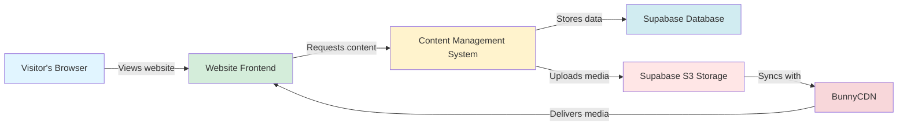
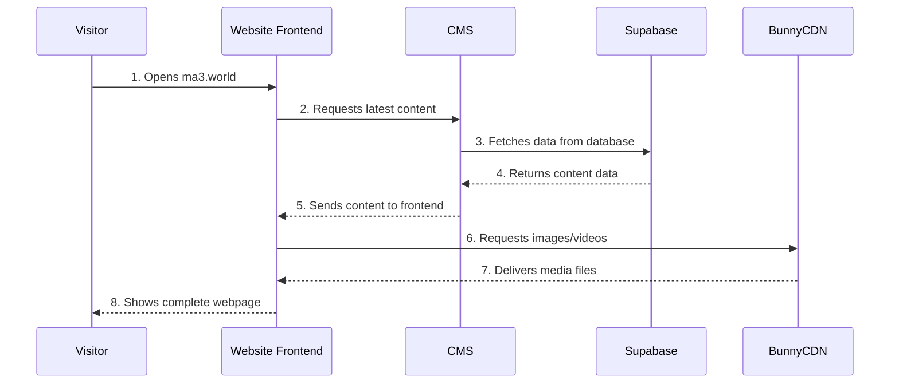
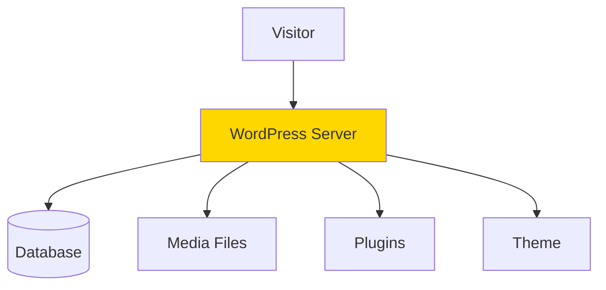
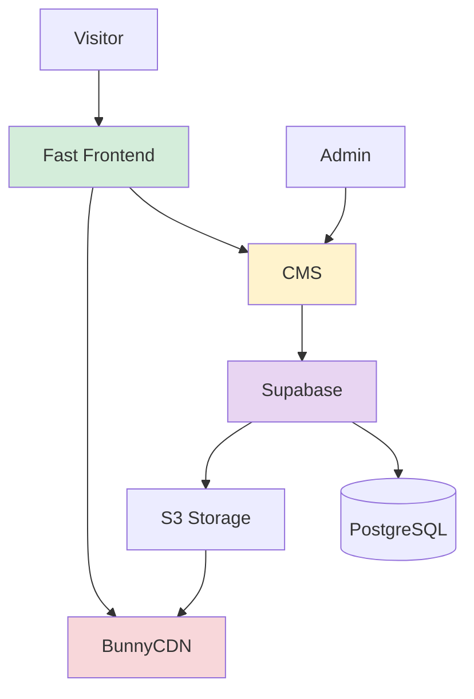
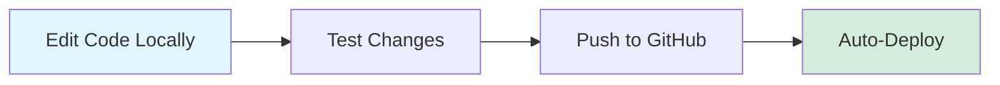

# MA3 Website Architecture Guide
*A Simple Introduction for Non-Technical Readers*

## What Is This Website?

The MA3 website is a modern, high-performance website designed for maximum speed, flexibility, and control. Think of it as a custom-built sports car, whereas WordPress is more like a standard family sedan — both get you where you need to go, but they work very differently under the hood.

---

## The Three Main Parts

Your website is built from three separate but connected parts, like a well-organized team where each member has a specific job:



### 1. **The Website Frontend** (What Visitors See)
- **Technology:** Astro with React
- **Hosted on:** GitHub Pages (free, fast delivery worldwide)
- **What it does:** This is the actual website that visitors see in their browser. It displays your projects, news, contact information, and everything visual.
- **Think of it as:** The storefront of a shop — beautiful, fast, and designed exactly how you want it.

### 2. **The Content Management System** (The Control Panel)
- **Technology:** Payload CMS
- **Hosted on:** Your own server
- **What it does:** This is your private admin panel where you can add new projects, update news, upload images, and manage all website content. Only you (and people you give access to) can log in here.
- **Think of it as:** The back office of the shop — where inventory is managed and updates are prepared.

### 3. **The Database & Storage** (Data Management)
- **Technology:** Supabase (PostgreSQL + S3 Storage)
- **What it does:** Stores all your content data (text, settings, relationships) and your original media files in a secure, managed database and storage system.
- **Think of it as:** A highly secure vault with organized filing cabinets for data and storage rooms for files.

### 4. **The Media Delivery** (Fast Worldwide Access)
- **Technology:** BunnyCDN
- **What it does:** Delivers your images and videos quickly to visitors around the world by caching them on servers close to your visitors.
- **Think of it as:** An express delivery network that keeps copies of your files in warehouses worldwide for instant access.

---

## How the Parts Work Together

Here's the journey when someone visits your website:



1. **A visitor types in your website address** (ma3.world)
2. **The website frontend loads** from GitHub Pages (very fast!)
3. **The frontend asks the CMS** "What projects should I show? What's the latest news?"
4. **The CMS responds** with all the content data
5. **The frontend requests images** from BunnyCDN
6. **BunnyCDN delivers the images** super quickly
7. **The visitor sees the complete website** with all content and images

---

## The Architecture in Detail

### Layer 1: The Presentation Layer (Frontend)

**What visitors interact with:**
- Beautiful, animated website pages
- Interactive 3D globe
- Project galleries
- News articles
- Contact forms

**Key Features:**
- **Blazing fast** — Loads almost instantly
- **Works in English and Japanese** — Automatic language switching
- **Responsive design** — Looks perfect on phones, tablets, and computers
- **SEO optimized** — Easy for Google to find and rank

### Layer 2: The Content Layer (CMS)

**What you use to manage content:**
- User-friendly admin dashboard
- Rich text editor for articles
- Image upload and management
- Draft/publish workflow
- Email notifications

**Key Features:**
- **Secure** — Only accessible with login credentials
- **Flexible** — Easy to add new types of content
- **Real-time** — Changes appear on the website immediately
- **Multilingual** — Manage English and Japanese content

### Layer 3: The Data & Storage Layer

**Database (Supabase PostgreSQL):**
- Stores all your content text, projects, news, and settings
- Keeps track of relationships between content
- Provides real-time updates and powerful querying
- Fully managed — no server maintenance needed

**File Storage (Supabase S3):**
- Stores original images, videos, and documents
- Provides secure, scalable storage
- Integrated authentication and access controls

**Media Delivery (BunnyCDN):**
- Caches and delivers media from servers worldwide
- Optimizes images automatically for faster loading
- Reduces load on your storage with edge caching

---

## How This Differs from WordPress

Most people are familiar with WordPress, so let's compare:

### WordPress Approach (All-in-One)



In WordPress, **everything happens on one server**:
- The website frontend
- The admin panel
- The database
- The file storage
- All the plugins and themes

**Analogy:** It's like having a restaurant where the dining area, kitchen, storage, and office are all in one small room.

### Your Approach (Separated & Specialized)



In your setup, **each part is specialized and separated**:
- Website frontend is optimized for speed
- CMS is focused on content management
- Media is delivered by a global network
- Each part can be upgraded independently

**Analogy:** It's like having a modern restaurant where the dining room is beautiful and spacious, the kitchen is professional-grade, and supplies come from specialized vendors.

---

## Advantages Over WordPress

### 🚀 **Speed**
- **WordPress:** Generates pages on-demand (slower, like cooking each meal when ordered)
- **Your Site:** Pre-built pages served instantly (like a well-stocked buffet ready to go)
- **Result:** Your site loads in milliseconds; WordPress can take seconds

### 🔒 **Security**
- **WordPress:** Admin panel and website on same server (one target for hackers)
- **Your Site:** CMS is separate and hidden; public site has no admin access
- **Result:** Much harder to hack; even if website is attacked, CMS is safe

### 💰 **Cost**
- **WordPress:** Pay for web hosting, often $5-50/month
- **Your Site:** 
  - Frontend hosting: FREE (GitHub Pages)
  - Database & Storage: Supabase (free tier or pay-as-you-go)
  - CMS: Your own server (you control the cost)
  - CDN: BunnyCDN (pay only for bandwidth used)
- **Result:** Potentially much cheaper, especially as traffic grows

### 🎨 **Flexibility**
- **WordPress:** Limited by themes and plugins; customization can break things
- **Your Site:** Complete control; built exactly to your specifications
- **Result:** Unique design, no compromises, no bloat

### 📊 **Performance at Scale**
- **WordPress:** Slows down with traffic; needs expensive caching plugins
- **Your Site:** Handles huge traffic easily; already optimized and cached
- **Result:** No performance degradation as you grow

### 🔧 **Maintenance**
- **WordPress:** Constant plugin/theme updates; high risk of breakage
- **Your Site:** Minimal maintenance; updates are controlled and tested
- **Result:** Less time fixing things, more time creating content

### 🌍 **Global Delivery**
- **WordPress:** Served from one location (slower for distant visitors)
- **Your Site:** Distributed globally (fast for everyone, everywhere)
- **Result:** Visitors in Japan and USA get same fast experience

---

## The Technology Stack (Simply Explained)

### Frontend Technologies

**Astro**
- Modern website framework
- Generates fast, optimized pages
- Think of it as: The blueprint system for building web pages

**React**
- Creates interactive components (like the 3D globe)
- Think of it as: The animation and interaction specialist

**TailwindCSS**
- Styling system for beautiful designs
- Think of it as: The interior designer

### Backend Technologies

**Payload CMS**
- Modern content management system
- Easy to customize and extend
- Think of it as: A smart filing cabinet with a nice interface

**PostgreSQL**
- Powerful, reliable database
- Think of it as: A highly organized digital library

**Next.js**
- Framework that runs the CMS
- Think of it as: The engine that powers the admin panel

### Supporting Services

**Supabase**
- All-in-one backend platform
- Provides PostgreSQL database and S3-compatible storage
- Think of it as: A managed data center that handles all your backend needs

**BunnyCDN**
- Global content delivery network
- Think of it as: A worldwide shipping service for your media

**GitHub Pages**
- Free static site hosting
- Think of it as: A reliable, fast web server that doesn't charge you

---

## The Monorepo Structure

Your project uses a "monorepo" — all the code lives in one organized place:

```
MA3 Project
├── apps/
│   ├── web/          → The website frontend (Astro)
│   └── cms/          → The admin panel (Payload CMS)
├── packages/         → Shared code & utilities
└── scripts/          → Build and deployment tools
```

**Why this matters:**
- **Organization:** Everything related to MA3 is in one place
- **Efficiency:** Shared code doesn't need to be duplicated
- **Simplicity:** One command runs both frontend and CMS locally
- **Version Control:** All changes are tracked together

Think of it like having your shop and warehouse in the same business park, but in separate buildings — close together but independently operated.

---

## Development Workflow

When you want to make changes, here's how it works:

### Making Content Updates


1. **Log into your CMS** (your admin panel)
2. **Add or edit content** (projects, news, images)
3. **Click publish**
4. **Website automatically updates** (visitors see changes immediately)

### Making Design Changes



1. **Developer edits code** on their computer
2. **Tests changes locally** to ensure everything works
3. **Pushes code to GitHub** when satisfied
4. **Website automatically rebuilds and deploys**

---

## Why This Architecture Is Better for MA3

### For Content Updates
**Traditional WordPress:** You have to worry about updates breaking the site.
**Your System:** Content updates are safe, simple, and instant.

### For Visitors
**Traditional WordPress:** Slow load times, especially from far away.
**Your System:** Lightning-fast load times worldwide.

### For Security
**Traditional WordPress:** Constant security updates and vulnerability worries.
**Your System:** Minimal attack surface; CMS is separate and protected.

### For Costs
**Traditional WordPress:** Monthly hosting fees that increase with traffic.
**Your System:** Frontend is free; you only pay for your CMS server and bandwidth.

### For Growth
**Traditional WordPress:** Slows down and gets expensive as you grow.
**Your System:** Stays fast and scales effortlessly.

---

## Summary

Your website is built like modern software — with separated concerns, optimized performance, and maximum flexibility. Instead of everything being tangled together like in WordPress, each part does one job really well:

- **Frontend:** Fast, beautiful, global
- **CMS:** Powerful, secure, easy to use
- **Media:** Quick delivery worldwide

This architecture gives you the best of all worlds: the ease of WordPress for content management, the speed of a static site, and the power of custom development — all while being more secure and potentially much cheaper.

**In one sentence:** Your website is a high-performance, custom-built system that's faster, more secure, and more scalable than traditional solutions like WordPress.
