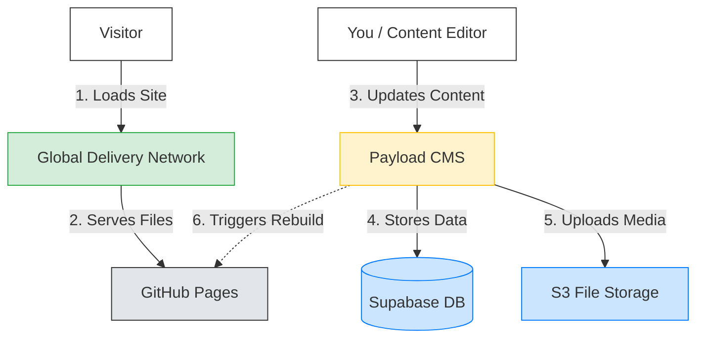
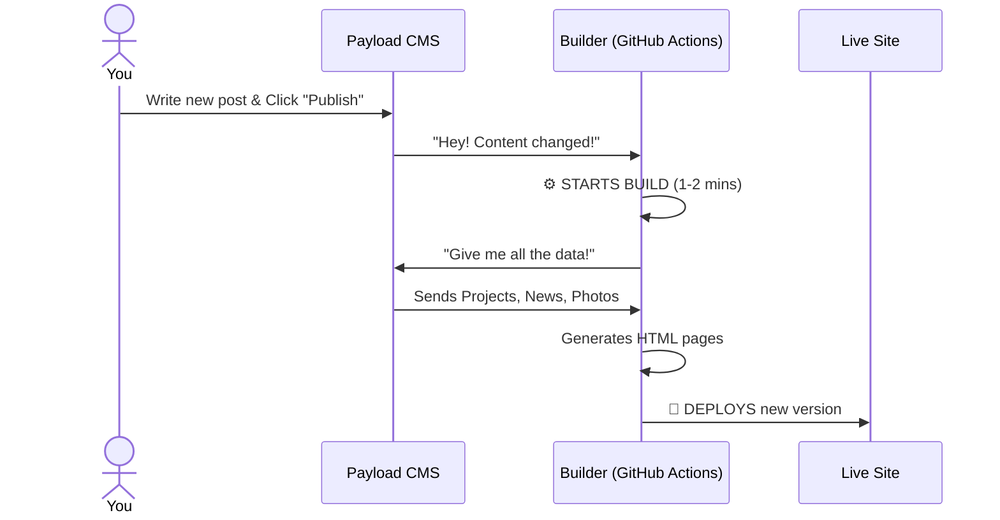

# Architecture Guide: How MA3 Works
*An explanation for humans, not robots.*

## The 30-Second Summary

Most websites (like WordPress) built the page *every single time* someone visits. It's like a restaurant cooking a meal from scratch for every customer—flexible, but slow.

**MA3 is a "Static Site".** We cook all the meals in advance (during the "Build"), pack them into lunchboxes, and ship them all over the world. When a visitor arrives, the food is already waiting. This makes it **instant** and **unbreakable**.

---

## 1. The Big Picture

Your website is a team of specialized services working together.

### The Key Players
1.  **Astro & GitHub Pages (The Storefront):** This is what users see. It's just simple HTML files. It cannot crash because there is no server processing logic when a user visits.
2.  **Payload CMS (The Control Room):** This is where you log in to edit text and upload photos. It lives on your private server.
3.  **Supabase (The Vault):** A secure database that actually holds your text and files. Payload talks to this.
4.  **BunnyCDN (The Delivery Trucks):** A network of servers around the world that keeps a copy of your photos so they load fast, whether the visitor is in Tokyo or New York.

---

## 2. The "Static" Magic (How Updates Work)

This is the most important concept. Since the site is pre-built, **changes are not instant-instant**. They take about 1-2 minutes to "Build".

### The "Build" Lifecycle

1.  **You Edit:** You change a title in the CMS.
2.  **The Wait:** The system automatically wakes up, grabs all your new content, and "re-prints" the entire website.
3.  **The Go-Live:** The old version is swapped for the new version instantly.

---

## 3. Why This vs. WordPress? (The Trade-offs)

We chose this architecture for specific reasons. It is not "better" at everything, but it is better for *this* project.

| Feature | WordPress (Traditional) | MA3 (Static Architecture) |
| :--- | :--- | :--- |
| **Speed** | 🐢 **Slow.** Server has to "think" for every visitor. | ⚡ **Instant.** Pages are pre-built HTML. |
| **Security** | 🛡️ **Riskier.** Hacker targets (plugins, login pages) are public. | 🔒 **Fort Knox.** The public site has *no* database or login page to hack. |
| **Cost** | 💸 **Expensive.** You pay for powerful servers to handle traffic. | 🆓 **Free/Cheap.** GitHub hosts the frontend for free. |
| **Traffic** | 📉 **Crushes.** A viral link can crash your server. | 📈 **Invincible.** Can handle 1 user or 1 million users equally well. |
| **Updates** | ✅ **Instant.** Click save, it's live 1 second later. | ⚠️ **Delayed.** Click save, wait ~2 mins for build. |
| **Flexibility** | ✅ **Plugins.** You can install a "Calendar" plugin yourself. | ⚠️ **Developer.** You need a coder to add new *features* (not content). |

### Summary on Trade-offs
You trade **instant updates** and **DIY plugins** for **unbeatable speed**, **security**, and **reliability**.

---

## 4. Deep Dive: The Data Infrastructure

For the technically curious, here is how we handle your assets.

### Supabase (Database & Storage)
We don't just save files on the CMS server (which can be risky if the server breaks). We use **Supabase**.
- **Postgres DB:** Stores your text content. Industrial-grade reliability.
- **S3 Storage:** Stores your raw uploaded images and videos.

### BunnyCDN (Content Delivery Network)
When you upload a huge 10MB image:
1.  **Payload** uploads it to **Supabase**.
2.  **BunnyCDN** sees it and makes optimized copies (smaller, web-friendly formats).
3.  When a user in London visits, BunnyCDN serves the image from a London server, not your main server.

This ensures your portfolio looks crisp and loads fast on 4G mobile connections everywhere.
